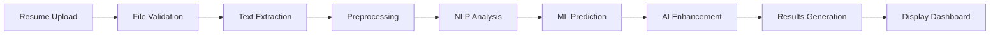

<div align="center">

# 🧠 AI-Powered Personality Prediction System


[](https://www.python.org/)
[](https://flask.palletsprojects.com/)
[](LICENSE)
[](https://github.com/engrmumtazali0112/personality-prediction-system)


### 🎯 Transforming Recruitment with AI-Powered Resume Intelligence

*Leverage cutting-edge NLP and Machine Learning to extract deep personality insights from resumes*

[🚀 Quick Start](#-quick-start) • [✨ Features](#-key-features) • [📸 Demo](#-demo--screenshots) • [📚 Documentation](#-technical-architecture)

</div>

---

## 🎯 Project Overview

<div align="center">

```ascii
╔════════════════════════════════════════════════════════════════╗
║                                                                ║
║   📊 Advanced Resume Analysis → 🤖 AI Processing              ║
║   → 🧠 Personality Insights → 📈 Data-Driven Decisions       ║
║                                                                ║
╚════════════════════════════════════════════════════════════════╝
```

</div>

The **Personality Prediction System** is an enterprise-grade AI platform that revolutionizes the recruitment process by analyzing resumes to predict personality traits with unprecedented accuracy. By combining Natural Language Processing (NLP), Machine Learning algorithms, and Google's Generative AI, this system empowers recruiters to make informed, data-driven hiring decisions.

### 🎭 Why This System?

<table>
<tr>
<td width="50%" align="center">

**🔍 For Recruiters**
<br><br>
✅ Reduce screening time by 80%<br>
✅ Eliminate unconscious bias<br>
✅ Improve candidate matching<br>
✅ Data-backed decision making<br>
✅ Predictive hiring insights

</td>
<td width="50%" align="center">

**💡 For Organizations**
<br><br>
✅ Lower hiring costs<br>
✅ Better culture fit<br>
✅ Reduced turnover<br>
✅ Improved team dynamics<br>
✅ Enhanced productivity

</td>
</tr>
</table>

---

## ✨ Key Features

<div align="center">


</div>

<table>
<tr>
<td width="33%" align="center">


### 📄 Multi-Format Support
Parse PDF, DOCX, and TXT files with intelligent text extraction and preprocessing

</td>
<td width="33%" align="center">


### 🤖 AI-Powered Analysis
Advanced NLP and ML models for deep personality trait prediction

</td>
<td width="33%" align="center">


### 📊 Comprehensive Insights
Detailed candidate profiles with actionable intelligence

</td>
</tr>
<tr>
<td width="33%" align="center">


### 💾 History Management
Complete analysis history with export capabilities

</td>
<td width="33%" align="center">


### 📱 Responsive Interface
Modern, intuitive web UI optimized for all devices

</td>
<td width="33%" align="center">


### 🔒 Secure Processing
Enterprise-grade security for sensitive data

</td>
</tr>
</table>

---

## 📸 Demo & Screenshots

<div align="center">


### 🎬 System in Action

</div>

<details open>
<summary><b>📊 Click to view application screenshots</b></summary>

<br>

<div align="center">

### 🏠 Home Dashboard


### 📤 Resume Upload Interface


### 📋 Analysis Results - Overview


### 🎯 Personality Traits Visualization


### 📊 Detailed Candidate Profile


### 🔍 Skills & Experience Analysis


### 📈 Comprehensive Report View


### 💼 Professional Assessment


### 🎨 Interactive Dashboard


### 📊 Analytics Overview


### 🔬 Deep Analysis View


### 📝 Final Report Summary


</div>

</details>

---

## 🚀 Quick Start

<div align="center">

```ascii
╔════════════════════════════════════════════════════════════╗
║          Get Started in Minutes, Not Hours!               ║
╚════════════════════════════════════════════════════════════╝
```

</div>

### 📋 Prerequisites

<p align="center">


</p>

### 🔧 Installation Steps

#### 1️⃣ Clone the Repository

```bash
# Clone via HTTPS
git clone https://github.com/engrmumtazali0112/personality-prediction-system.git

# Or clone via SSH
git clone git@github.com:engrmumtazali0112/personality-prediction-system.git

# Navigate to project directory
cd personality-prediction-system
```

#### 2️⃣ Set Up Virtual Environment

```bash
# Create virtual environment
python -m venv myenv

# Activate on Windows
myenv\Scripts\activate

# Activate on macOS/Linux
source myenv/bin/activate
```

#### 3️⃣ Install Dependencies

```bash
# Upgrade pip
pip install --upgrade pip

# Install all requirements
pip install -r requirements.txt
```

#### 4️⃣ Configure Environment

```bash
# Copy environment template
cp .env.example .env

# Edit .env and add your Google GenerativeAI API key
# GOOGLE_API_KEY=your_api_key_here
```

#### 5️⃣ Launch Application

```bash
# Start the Flask server
python app.py

# Open browser and navigate to
# http://localhost:5000
```

<div align="center">

### 🎉 That's it! You're ready to analyze resumes!

</div>

---

## 📁 Project Architecture

<div align="center">

```ascii
╔════════════════════════════════════════════════════════════╗
║              Clean, Modular Architecture                   ║
╚════════════════════════════════════════════════════════════╝
```

</div>

```
personality-prediction-system/
│
├── 📂 myenv/                      # Virtual environment
├── 📂 __pycache__/                # Python cache files
├── 📂 .idea/                      # IDE configuration
│
├── 📂 static/                     # Static assets
│   ├── 📂 css/                    # Stylesheets
│   ├── 📂 js/                     # JavaScript files
│   └── 📂 img/                    # Images & icons
│
├── 📂 templates/                  # HTML templates
│   ├── 📄 index.html              # Main page
│   └── 📄 result.html             # Results page
│
├── 📂 uploads/                    # Uploaded resumes
│
├── 🐍 ai_prediction.py            # AI model integration
├── 🐍 app.py                      # Flask application
├── 🐍 prediction.py               # Prediction engine
├── 🐍 resume_extraction.py        # Text extraction
│
├── 📊 education.txt               # Education keywords
├── 📊 extracted_data.csv          # Processed data
├── 📊 resume_dataset.csv          # Training dataset
├── 📊 skills.txt                  # Skills database
├── 📊 traits.txt                  # Personality traits
├── 📊 workExp.txt                 # Work experience data
│
├── 📄 requirements.txt            # Dependencies
├── 📄 .gitignore                  # Git ignore rules
├── 📄 LICENSE                     # MIT License
└── 📄 README.md                   # Documentation
```

---

## 💻 Usage Guide

<div align="center">


</div>

### 🎯 Step-by-Step Workflow

<table>
<tr>
<td width="33%" align="center">

### 1️⃣ Upload Resume


**Supported Formats:**
- 📄 PDF files
- 📝 DOCX documents
- 📋 TXT files

Secure file handling with validation

</td>
<td width="33%" align="center">

### 2️⃣ AI Analysis


**Processing Pipeline:**
- 🔍 Text extraction
- 🧹 Data cleaning
- 🤖 AI prediction
- 📊 Trait analysis

Real-time processing

</td>
<td width="33%" align="center">

### 3️⃣ View Results


**Comprehensive Report:**
- 📈 Personality traits
- 💼 Skills assessment
- 🎓 Education analysis
- 📊 Experience review

Export & share ready

</td>
</tr>
</table>

### 🔄 Advanced Features

```python
# API Endpoints Overview

POST /analyze          # Submit resume for analysis
├── Input: Resume file (PDF/DOCX/TXT)
├── Process: NLP + ML + AI analysis
└── Output: Personality insights JSON

GET /history           # Retrieve analysis history
├── Returns: All previous analyses
└── Format: Structured JSON array

POST /clear_history    # Clear analysis history
└── Action: Removes all stored analyses

GET /export_data       # Export analysis data
├── Format: CSV file
└── Contains: Complete analysis records
```

---

## 🛠️ Technical Architecture

<div align="center">


</div>

### 📊 Processing Pipeline



### 🧠 Core Technologies

<table>
<tr>
<td width="50%">

#### 🔬 AI & Machine Learning
- **NLP Framework**: NLTK for text processing
- **AI Engine**: Google GenerativeAI
- **Text Analysis**: Advanced tokenization
- **Pattern Recognition**: Regex-based extraction
- **Prediction Models**: Custom ML algorithms
- **Data Processing**: Pandas & NumPy

</td>
<td width="50%">

#### 🌐 Web Framework
- **Backend**: Flask 2.0+ (Python)
- **Frontend**: HTML5, CSS3, JavaScript
- **Templating**: Jinja2
- **File Handling**: Secure multipart uploads
- **API**: RESTful endpoints
- **Database**: CSV-based storage

</td>
</tr>
</table>

### 🎨 Technology Stack

<p align="center">


</p>

---

## 🗺️ Development Roadmap

<div align="center">

### 🚀 Future Enhancements

</div>

<table>
<tr>
<td width="50%">

#### 🎯 Phase 1 - Q2 2024
- [x] Core functionality
- [x] Basic UI/UX
- [ ] Enhanced ML models
- [ ] Multi-language support
- [ ] Batch processing

</td>
<td width="50%">

#### 🎯 Phase 2 - Q3 2024
- [ ] Advanced visualization
- [ ] API authentication
- [ ] Cloud storage integration
- [ ] Real-time collaboration
- [ ] Mobile application

</td>
</tr>
</table>

---

## 🤝 Contributing

<div align="center">

```ascii
╔═══════════════════════════════════════════════════════════╗
║     We ❤️ Contributions! Help Us Make This Better!       ║
╚═══════════════════════════════════════════════════════════╝
```

</div>

### 🌟 How to Contribute

1. **🍴 Fork** the repository
2. **🔧 Create** your feature branch
   ```bash
   git checkout -b feature/AmazingFeature
   ```
3. **💾 Commit** your changes
   ```bash
   git commit -m 'Add some AmazingFeature'
   ```
4. **📤 Push** to the branch
   ```bash
   git push origin feature/AmazingFeature
   ```
5. **🎉 Open** a Pull Request

### 📝 Contribution Guidelines

<table>
<tr>
<td width="50%">

**✅ Do's**
- Follow PEP 8 style guide
- Write clear commit messages
- Add tests for new features
- Update documentation
- Comment complex code

</td>
<td width="50%">

**❌ Don'ts**
- Don't break existing tests
- Avoid large, unfocused PRs
- Don't ignore code reviews
- Skip documentation updates
- Introduce security vulnerabilities

</td>
</tr>
</table>

---

## 📄 License

<div align="center">

This project is licensed under the **MIT License**

[](https://opensource.org/licenses/MIT)

*See [LICENSE](LICENSE) file for full details*

</div>

---

## 🙏 Acknowledgments

<div align="center">


### 💝 Special Thanks To

</div>

<table>
<tr>
<td align="center" width="25%">
<br>
<b>NLTK Team</b><br>
<sub>Natural Language Processing</sub>
</td>
<td align="center" width="25%">
<br>
<b>Google AI</b><br>
<sub>Generative AI Capabilities</sub>
</td>
<td align="center" width="25%">
<br>
<b>Flask Community</b><br>
<sub>Web Framework Excellence</sub>
</td>
<td align="center" width="25%">
<br>
<b>Open Source</b><br>
<sub>Community Contributors</sub>
</td>
</tr>
</table>

---

## 📞 Contact & Connect

<div align="center">


### 👨‍💻 Mumtaz Ali

**AI/ML Engineer | Full Stack Developer | Innovation Enthusiast**

<p align="center">
<a href="mailto:engrmumtazali01@gmail.com">

</a>
<a href="https://www.linkedin.com/in/mumtaz-ali">

</a>
<a href="https://github.com/engrmumtazali0112">

</a>
<a href="https://www.instagram.com/its_maliyzi">

</a>
<a href="https://x.com/mumtazali1223">

</a>
<a href="https://discord.gg/DZgwHzEb">

</a>
<a href="https://wa.me/923476338292">

</a>
</p>

### 💬 Let's Collaborate!

Open to collaboration on AI/ML projects, open-source contributions,<br>
and innovative tech solutions. Feel free to reach out!

</div>

---

## 📊 Project Stats

<div align="center">


</div>

---

<div align="center">


### ⭐ If you find this project helpful, please consider giving it a star!

**Made with ❤️ and ☕ by Mumtaz Ali**

*Last Updated: February 2024*

</div>
